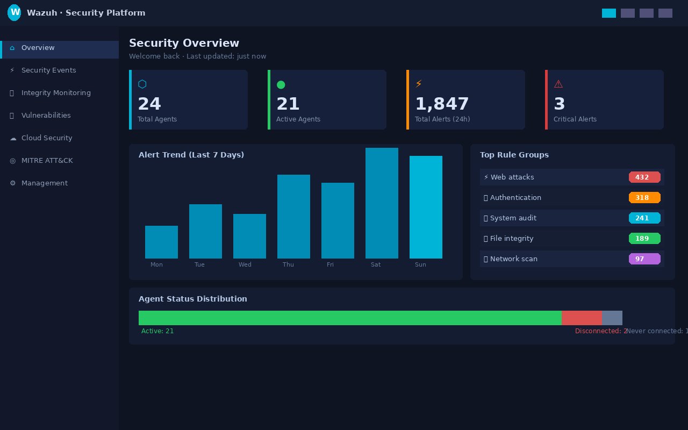

# 🛡️ Home SOC Lab — Full Setup Guide

> A complete, step-by-step guide to building a home Security Operations Center (SOC) lab using **Wazuh**, **Splunk**, **Docker**, and a custom **SOC Automation Script**.

---

## 📸 Screenshots

| Wazuh Dashboard | Splunk Alerts | SOC Script Output |
|---|---|---|
|  |  |  |

---

## 🏗️ Architecture

```
┌─────────────────────────────────────────────────────────────────────┐
│                        SOC LAB ARCHITECTURE                          │
├─────────────────────────────────────────────────────────────────────┤
│                                                                       │
│   Monitored Endpoints          Wazuh Server (Ubuntu)                 │
│   ┌──────────────┐            ┌──────────────────────────┐           │
│   │ Windows      │──agents──▶ │  Wazuh Manager :55000    │           │
│   │ Server       │            │  Wazuh Indexer :9200     │           │
│   └──────────────┘            │  Wazuh Dashboard :443    │           │
│   ┌──────────────┐            │  Docker Listener         │           │
│   │ Linux        │──agents──▶ │  SOC Automation Script   │           │
│   │ Machines     │            └──────────┬───────────────┘           │
│   └──────────────┘                       │                           │
│   ┌──────────────┐                       │ HEC Forward               │
│   │ Docker       │──listener─▶           │ (port 8088)               │
│   │ Containers   │            ┌──────────▼───────────────┐           │
│   └──────────────┘            │  Splunk Enterprise       │           │
│                               │  Windows Server :8000    │           │
│                               │  Custom SOC Dashboard    │           │
│                               └──────────────────────────┘           │
└─────────────────────────────────────────────────────────────────────┘
```

---

## 📋 Table of Contents

1. [Prerequisites](#prerequisites)
2. [Wazuh Server Setup](#wazuh-server-setup)
3. [Docker Setup & Monitoring](#docker-setup--monitoring)
4. [SOC Automation Script](#soc-automation-script)
5. [Splunk Setup](#splunk-setup)
6. [Wazuh → Splunk Integration](#wazuh--splunk-integration)
7. [Splunk SOC Dashboard](#splunk-soc-dashboard)
8. [Troubleshooting](#troubleshooting)

---

## 🖥️ Lab Specs

| Component | Spec |
|---|---|
| Wazuh Server OS | Ubuntu 22.04 / 24.04 LTS |
| Splunk OS | Windows Server |
| Wazuh Version | 4.x (single-node) |
| Splunk Version | 10.2.x Enterprise (Free tier) |
| Python | 3.10+ |
| Docker | 29.x |

---

## 🔄 Data Flow

```
1.  Event occurs on endpoint (login, file change, process, etc.)
         ↓
2.  Wazuh Agent detects and forwards to Wazuh Manager
         ↓
3.  Wazuh Manager matches against 3000+ security rules
         ↓
4.  Alert stored in Wazuh Indexer (OpenSearch)
         ↓
5.  Alert visible in Wazuh Dashboard
         ↓
6.  Python forwarder tails alerts.json in real time
         ↓
7.  Alert forwarded to Splunk via HTTP Event Collector (HEC)
         ↓
8.  Alert visible in Splunk Search & custom dashboard
         ↓
9.  SOC Automation Script enriches alerts hourly via cron
         ↓
10. JSON triage report saved with MITRE ATT&CK recommendations
```

---

## ⚡ Quick Start

```bash
# Clone the repo
git clone https://github.com/yourusername/soc-lab.git
cd soc-lab

# Copy environment config
cp .env.example .env
nano .env  # fill in your credentials

# Install dependencies
python3 -m venv venv
source venv/bin/activate
pip install -r requirements.txt

# Run SOC automation
python3 scripts/soc_automation_wazuh.py --mode full
```

---

## 📁 Repository Structure

```
soc-lab/
├── README.md                        # This file
├── .env.example                     # Environment config template
├── requirements.txt                 # Python dependencies
├── scripts/
│   ├── soc_automation_wazuh.py      # Main SOC automation script
│   ├── soc_automation_splunk.py     # Splunk SOC automation script
│   └── wazuh_to_splunk.py           # Wazuh → Splunk forwarder
├── docs/
│   ├── 01-prerequisites.md          # System requirements
│   ├── 02-wazuh-setup.md            # Wazuh installation guide
│   ├── 03-docker-setup.md           # Docker setup & monitoring
│   ├── 04-soc-automation.md         # SOC script setup
│   ├── 05-splunk-setup.md           # Splunk installation
│   ├── 06-integration.md            # Wazuh → Splunk integration
│   ├── 07-dashboard.md              # Building Splunk dashboards
│   └── 08-troubleshooting.md        # Common issues & fixes
├── screenshots/                     # Add your screenshots here
│   ├── wazuh-dashboard.png
│   ├── splunk-alerts.png
│   └── soc-script.png
└── diagrams/                        # Architecture diagrams
    └── architecture.md
```

---

## 🤝 Contributing

Pull requests welcome! Please open an issue first to discuss changes.

---

## 📄 License

MIT License — free to use and modify.

---

## ⚠️ Disclaimer

This lab is for **educational purposes only**. Only deploy on systems you own or have explicit permission to monitor.
