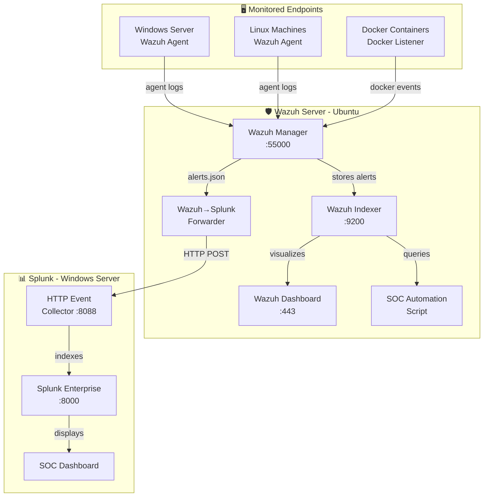
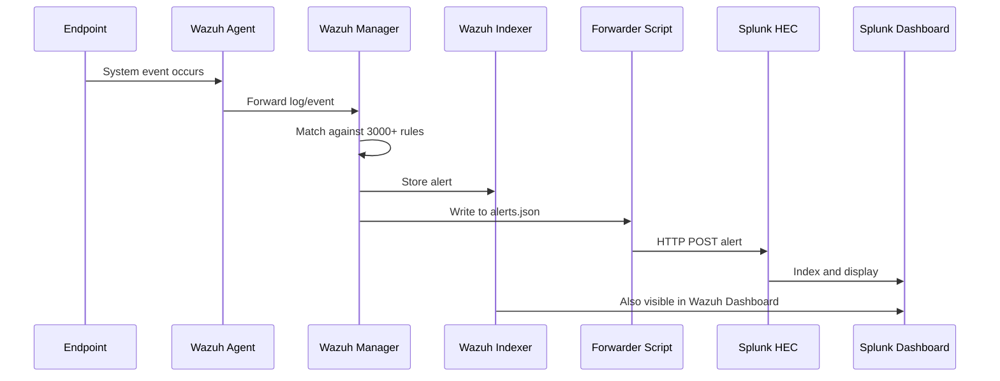
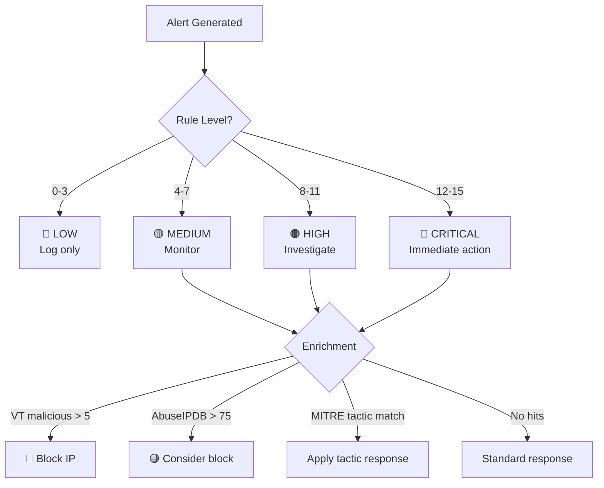
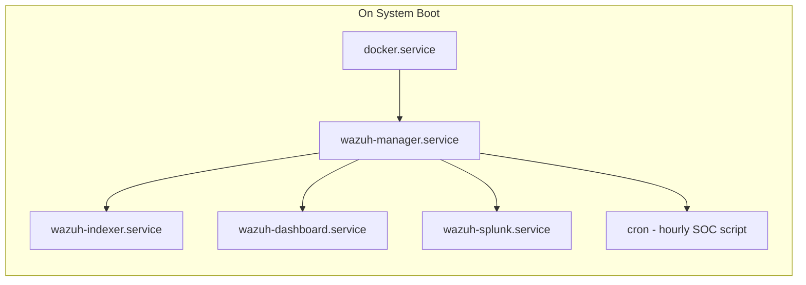
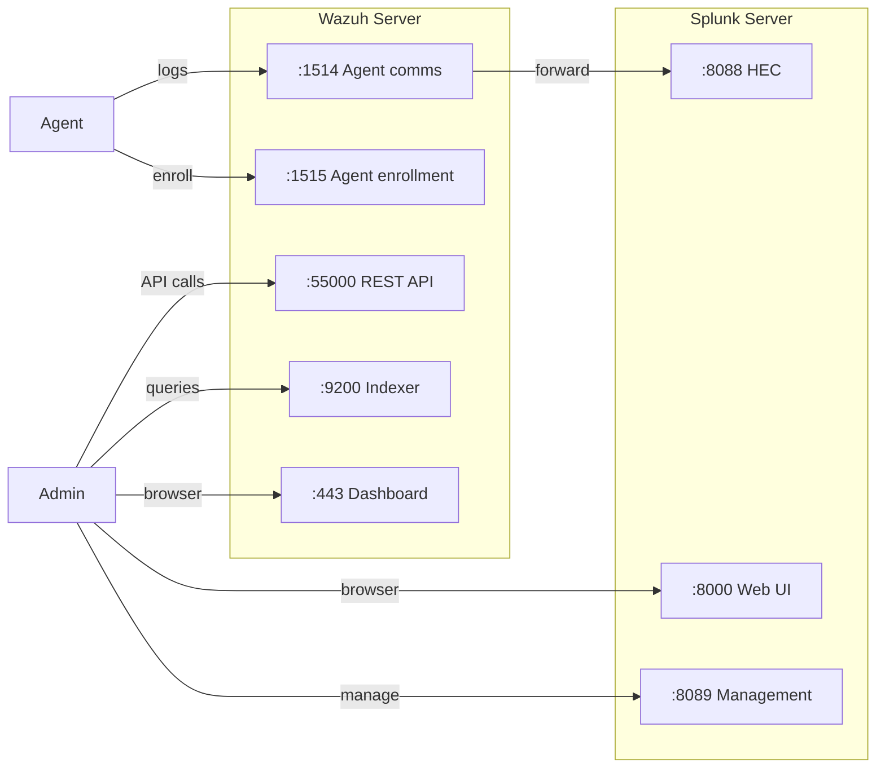

# 🗺️ Architecture Diagrams

These diagrams can be rendered on GitHub automatically using Mermaid syntax.

---

## Full SOC Lab Architecture

---

## Data Flow Diagram

---

## Alert Severity Flow

---

## Service Architecture

---

## Network Ports

